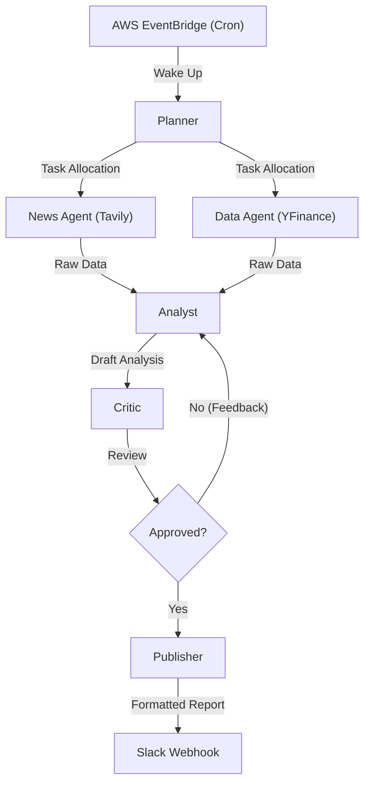

# 🛡️ Sentinels: Autonomous Financial Agent

   

A proactive, multi-agent AI system that functions as a personal hedge fund analyst. Instead of waiting for prompts, **Sentinels** wakes up at 6:00 AM, researches your specific portfolio, performs a "Reasoning & Critique" loop to filter noise, and pushes a briefed executive summary to Slack.

## 🏗️ Architecture

The system uses a **Cyclic State Graph** (not a linear chain). Agents can reject each other's work and request revisions if the analysis is not grounded in data.



## 🚀 Key Features

* **Self-Correcting Intelligence:** Implemented a `Critic` node that reviews the `Analyst`'s output. If the sentiment is unsupported by data (e.g., "Bullish" but price dropped 5%), the draft is rejected and sent back for revision.
* **Serverless Containerization:** Due to heavy dependencies (Pandas, LangChain, Numpy), the agent is packaged as a Docker container and deployed to **AWS Lambda** (ECR Image type).
* **Push-Based Workflow:** Uses **AWS EventBridge Scheduler** to trigger execution, removing the need for a 24/7 server.
* **Cost Efficient:** Runs on-demand for <2 minutes daily, staying well within the AWS Free Tier.

## 🛠️ Tech Stack

* **Orchestration:** LangGraph (Stateful Multi-Agent Workflow)
* **Infrastructure:** AWS Lambda (Dockerized), Amazon ECR, AWS EventBridge
* **Models:** GPT-4o-mini (Analysis), Tavily API (Search)
* **Deployment:** Docker Cross-Architecture Builds (`linux/amd64`)

## 💻 Setup & Run Locally

### 1. Clone & Configure

```bash
git clone [https://github.com/aadeshh/Sentinels.git](https://github.com/aadeshh/Sentinels.git)
cd Sentinels
# Create a .env file with your keys:
# OPENAI_API_KEY=sk-...
# TAVILY_API_KEY=tvly-...
# SLACK_WEBHOOK_URL=[https://hooks.slack.com/](https://hooks.slack.com/)...

```

### 2. Run with Docker (Simulating Production)

Since this uses Lambda architecture, we build the container to run locally.

```bash
# Build for the correct architecture
docker build --platform linux/amd64 -t financial-agent .

# Run the container mapping port 9000
docker run --platform linux/amd64 -p 9000:8080 --env-file .env financial-agent

```

### 3. Trigger the Agent

Open a new terminal and send a payload (simulating an EventBridge trigger):

```bash
curl -XPOST "http://localhost:9000/2015-03-31/functions/function/invocations" \
-d '{"portfolio": ["NVDA", "TSLA", "BTC-USD"]}'

```

---

*Created by Aadesh Thoppae*
